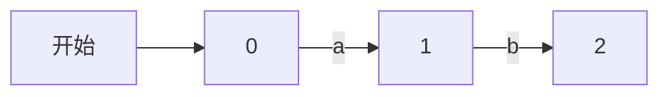
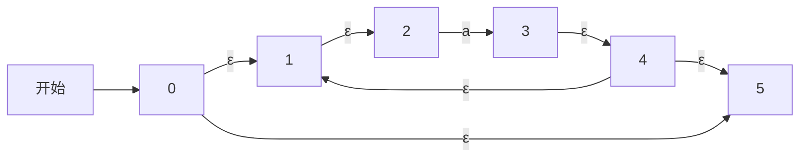
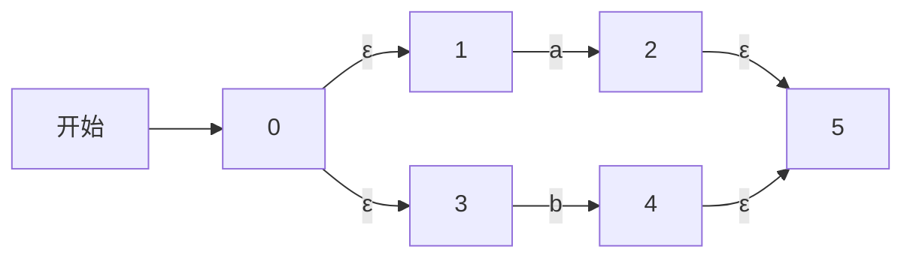
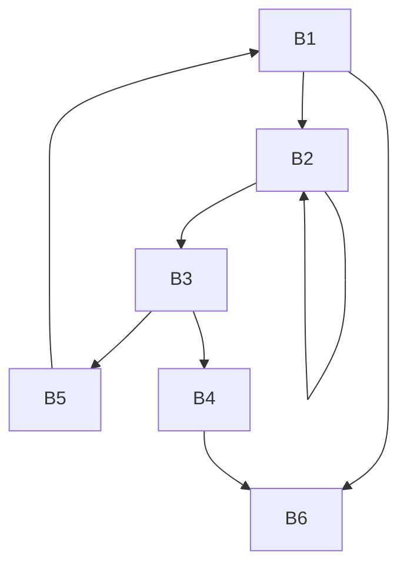

> 本文档的内容只针对编译原理部分算法进行了简单通俗的总结，略过了比较复杂的东西。
>
> 本文档只关心怎么做题，对于算法的原理、目的等等在实践中有意义的内容，一点儿也不关心。
>
> 建议考试目的是及格而非高分的同学阅读。

## 词法分析

### 正则表达式

#### 什么是正则表达式？

正则表达式就是一个符号串，而这个符号串中的符号可以代表特定的字符，所以可以用正则表达式来表示符合特定结构的字符串

#### 正则表达式基本规则

| 表达式   | 匹配                                    | 例子      |
| :------- | :-------------------------------------- | :-------- |
| `c`      | 单个非运算符字符 `c`                    | `a`       |
| `\c`     | 字符 `c` 的字面值                       | `\*`      |
| `"s"`    | 串 `s` 的字面值                         | `"**"`    |
| `.`      | 除换行符以外的任何字符                  | `a.*b`    |
| `^`      | 一行的开始                              | `^abc`    |
| `$`      | 行的结尾                                | `abc$`    |
| `[s]`    | 字符串 `s` 中的任何一个字符             | `[abc]`   |
| `[^s]`   | 不在串 `s` 中的任何一个字符             | `[^abc]`  |
| `r*`     | 和 `r` 匹配的零个或多个串连接成的串     | `a*`      |
| `r+`     | 和 `r` 匹配的一个或多个串连接成的串     | `a+`      |
| `r?`     | 零个或一个 `r`                          | `a?`      |
| `r{m,n}` | 最少 `m` 个，最多 `n` 个 `r` 的重复出现 | `a{1,5}`  |
| `r1r2`   | `r1` 后加上 `r2`                        | `ab`      |
| `r1|r2`  | `r1` 或 `r2`                            | `a|b`     |
| `(r)`    | 与 `r` 相同                             | `(a|b)`   |
| `r1/r2`  | 后面跟有 `r2` 时的 `r1`                 | `abc/123` |

### 正则表达式转 NFA

主要掌握三种正则表达式 `a*`，`a|b`，`ab` 怎么画就行，并且懂得如何把它们组合起来，注意接收状态画双圈

#### `ab`




#### `a*`




#### `a|b`




### NFA 转成 DFA

#### 核心基本概念

1. $I$

   $I$ 是一个集合，其中的元素是 NFA 图中的顶点

2. $\varepsilon\text{-closure}(I)$

   $\varepsilon\text{-closure}(I)$ 是一个集合，其中的元素也是 NFA 图中的顶点，并且这个顶点要么是 $I$ 中的顶点，要么必须可以由 $I$ 中的顶点出发，且必须经过了至少一条 $\varepsilon$ 弧抵达（之后这个东西简称 $I$ 的闭包）

3. $\text{move}(I, a)$

   $\text{move}(I, a)$ 是一个集合，其中的元素是 NFA 图中的顶点，并且这个顶点必须可以由 $I$ 中的顶点出发，且必须经过了一条 $a$ 弧抵达（注意，是必须经过**一条** $a$ 弧，多了少了都不可以）

#### 转换过程

1. 先求 开始顶点$\{0\}$ 的闭包，记作 $T_0$
2. 然后分别求 $\text{move}(T_0, a)$，$\text{move}(T_0, b)$，$\text{move}(T_0, c)$……之后再分别求它们的闭包，把求闭包的结果分别记作 $T_1$, $T_2$, $T_3$……
3. 接着依次对 $T_1$, $T_2$, $T_3$ 等等分别求 $\text{move}(T_n, a)$，$\text{move}(T_n, b)$，$\text{move}(T_n, c)$……之后再分别求它们的闭包——流程刚才上一步一样。如果出现了新的 $T_n$，那就再记录下来
4. 如此反复，直到不再出现新的 $T_n$
5. 把得到的所有 $T_n$ 当作顶点，如果存在这样的关系：$\text{move}(T_i, a)$ 的闭包 = $T_j$，那么就由顶点 $T_i$ 出发，到顶点 $T_j$，画一条单向 $a$ 弧
6. 连上所有有可能的弧后，如果一个集合 $T_n$ 包含了任何一个原 NFA 的接收状态顶点，那么 $T_n$ 对应的顶点也是接收状态顶点，画成双圈标明
7. 标明了所有的接收状态顶点后，你就画好了 DFA 图

### DFA 的化简（似乎不重要）

#### 化简过程

1. 先把 DFA 图中的所有顶点，按照标准"**是/不是**接收状态顶点"划分成两个集合 $S_1$， $S_2$
2. 再把集合 $S_1$ 中的所有顶点，按照标准"在经过了一条 $a$ 弧后抵达的顶点**属于/不属于**集合 $S_1$"分割成两个集合 $S_3$， $S_4$
3. 再把集合 $S_1$ 中的所有顶点，按照标准"在经过了一条 $b$ 弧后抵达的顶点**属于/不属于**集合 $S_1$"分割成两个集合 $S_5$， $S_6$
4. 如此反复，直到检查了所有的符号，再去按照这个方法检查集合 $S_2$， $S_3$， $S_4$......
5. 当剩下的集合全都没办法分割后，检查 DFA 图的顶点，如果两个顶点在同一个集合中，那么就合并它们（“合并”就是离散数学图论中的“顶点合并”）
6. 合并了所有可合并的顶点后，你就画好了简化后的 DFA 图

---

## 语法分析

### 自上而下的语法分析

#### 最左/最右推导

最左/最右推导就是每次推导，都选择产生右部中，从左/右数的第一个非终结符展开，通过这种规则来得到符号串的推导方式。

#### 消除左递归文法

##### 什么是左递归文法？

左递归文法就是在推导过程中可能出现循环推导，以致推导不能结束的现象的文法

- 直接左递归：对于一个产生式，如果产生右部的第一个字符等于产生左部的字符，那么就是直接左递归

  如 $A \rightarrow A+b$，这里最左推导下去就会出现 $A \rightarrow A+b+b$，接着是 $A \rightarrow A+b+b+b$，推导永远无法停下

- 间接左递归：对于一系列产生式，如果出现了"循环结构"关系，使得直接左递归可能出现在推导过程中，那么就是间接左递归

  如文法：
  $$
  \begin{aligned}
  (1)\; A &\rightarrow Ba \\
  (2)\; B &\rightarrow Aa
  \end{aligned}
  $$
  这里最左推导 $(1)$ 式的话，就会得到 $A \rightarrow Aaa$，也就出现了直接左递归

##### 消除左递归文法的方法

1. 消除直接左递归

   有文法形如：
   $$
   \begin{aligned}
   (1)\; A &\rightarrow B \\
   (2)\; A &\rightarrow Ab
   \end{aligned}
   $$
   前一句没有左递归现象，后一句有左递归现象

   对于没有左递归现象的语句，都像这样改写：$A \rightarrow BA'$，保留原来的产生右部，并且在末尾添加个 $A'$

   对于有左递归现象的语句，都像这样改写：$A' \rightarrow bA' \mid \varepsilon$，产生左部直接改成 $A'$；产生右部将原来的 $A$ 删掉，再在最右边加一个 $A'$；最后再新添加一个产生式 $A' \rightarrow \varepsilon$

2. 消除间接左递归

   有文法形如：
   $$
   \begin{aligned}
   (1)\; A &\rightarrow Ba \\
   (2)\; B &\rightarrow Aa
   \end{aligned}
   $$
   先推导一步 $(1)$ 式，得到直接左递归语句 $A \rightarrow Aaa$，然后针对这个语句再使用上面的方法消除直接左递归

#### 公共左因子

##### 什么是公共左因子？

有文法形如：
$$
A \rightarrow aaaA++ \mid aaaB-- \mid aaa \mid D \mid bbb
$$
$aaa$ 就是前三个语法规则的公共左因子

##### 提取公共左因子

有文法形如：
$$
A \rightarrow aaaA++ \mid aaaB-- \mid aaa \mid D \mid bbb
$$

先将公共左因子后面的内容都单独拿出来写出新的语法规则，如 $A' \rightarrow A++ \mid B-- \mid \varepsilon$（注意 $A \rightarrow aaa$ 这条规则别忘了用 $A' \rightarrow \varepsilon$ 对应上）

然后将这个新的语法规则替换到原来的语法规则中，如 $A \rightarrow aaaA' \mid D \mid bbb$

这样就OK了

#### 递归下降分析法

##### 前提

你需要把给定的文法进行以下处理：

- 消除左递归文法
- 提取了公共左因子

##### 过程

举个例子，有文法：

$$
\begin{aligned}
E &\to T E_1 \\
E_1 &\to + T E_1 \mid - T E_1 \mid \varepsilon \\
T &\to F T_1 \\
T_1 &\to * F T_1 \mid / F T_1 \mid \varepsilon \\
F &\to (E) \mid i
\end{aligned}
$$

文法怎么写，函数就怎么写

比如 $E$ 对应的文法是 $E \rightarrow TE_1$，那么其对应的函数就这么写

```c
void E() {
    advance(); // 每个非终结符的解析函数开头都是这个
    T(); // T对应的函数
    E1(); // E1对应的函数
}
```

如果对应的文法中有 `|` 逻辑，那么稍微复杂一点，需要 `if-else` 的匹配逻辑

比如 $F$ 对应的文法是 $F \rightarrow (E) \mid i$，那么其对应的函数就这么写

```c
void F() {
	advance();
    if (input[pos] == '(') { // 确定是F -> (E)
        match('(');
		E();
        match(')');
    } else if (isdigit(input[pos])) { // 确定是F -> i
        printf("%c", input[pos]);
        pos++;
    } else {
        error();
    }
}
```

#### 计算 $FIRST$ 集和 $FOLLOW$ 集

##### 什么是 $FIRST$ 集？(之后简称 $FI$ 集)

$\text{FIRST}(A)$ 是一个集合，其中的元素满足以下特点：

1. 元素是一个终结符或 $\varepsilon$

2. 当且仅当对符号 $A$ 进行推导时，最终推导结果有可能是 $\varepsilon$，那么 $\varepsilon$ 会是这里的元素

3. 除此之外，在对符号 $A$ 进行推导时，最终推导结果中的第一个终结符，那么这个终结符

   （又因为非终结符的最终推导结果全都是终结符，所以这个元素肯定也是结果中的第一个符号）

##### 求 FI 集流程

你想求 $FI(X)$，你就去看所有产生左部是 $X$ 的产生式就可以了

举个例子，文法如下：

$$
\begin{aligned}
E &\to T E_1 \\
E_1 &\to + T E_1 \mid - T E_1 \mid \varepsilon \\
T &\to F T_1 \\
T_1 &\to * F T_1 \mid / F T_1 \mid \varepsilon \\
F &\to (E) \mid i
\end{aligned}
$$

1. 从最底端的文法开始看，这样一般可以直接看到文法中固定了的终结符，这样的 $FI$ 集最好求

   比如：$F \rightarrow (E) \mid i$，那么 $FI(F)=\{(, i\}$；$T_1 \rightarrow *FT_1 \mid /FT_1 \mid \varepsilon$，那么 $FI(T_1) = \{*, /, \varepsilon\}$

2. 接着看上一层的文法，如果有形如 $A \rightarrow Babc$ 这样的文法，特点是一个产生式的产生右部最开始就是一个非终结符 $B$，那么 $FI(B)$ 中的元素肯定也会在 $FI(A)$ 中

   比如：$T \rightarrow FT_1$，那么 $FI(T)=FI(F)$；$E \rightarrow TE_1$，那么 $FI(E) = F(T)$

3. 如果某一个非终结符 $A$ 可能推导成 $\varepsilon$，那么就除此之外还要当作 $A$ 不存在，再重新推导一遍，把新得到结果加进去

简单来说，求 $\text{FIRST}$ 集，要么直接看非终结符，要么就看继承

##### 什么是 FOLLOW 集？(之后简称 FO 集)

$\text{FOLLOW}(A)$ 是一个集合，其中元素满足以下特点：

1. 元素是一个终结符或行尾标记 $\$$（这意味着不可能为 $\varepsilon$）
2. 在任意产生式的推导过程中，如果 $A$ 屁股后面紧跟着一个终结符，那么这个终结符会是这里的元素（这意味着，这个终结符肯定不会是由 $A$ 推导出来的）
3. 在任意产生式的推导过程中，如果 $A$ 屁股后面可能什么都没有，那么 $\$$ 会是这里的元素

##### 求 FO 集流程

求 $FO(X)$，你就先看所有产生右部中有 $X$ 的产生式就可以了

举个例子，文法同上：

$$
\begin{aligned}
E &\to T E_1 \\
E_1 &\to + T E_1 \mid - T E_1 \mid \varepsilon \\
T &\to F T_1 \\
T_1 &\to * F T_1 \mid / F T_1 \mid \varepsilon \\
F &\to (E) \mid i
\end{aligned}
$$

1. 如果 $X$ 是开始符号，那么 $FO(X)$ 集中肯定有 $\$$

   比方说 $FO(E)$

2. 如果 $X$ 后面可能挨着了终结符 $a$，那么 $FO(X)$ 中肯定有 $a$

   比方说文法 $F \rightarrow (E) \mid i$，那么 $FO(E)$ 中肯定有 `)`

3. 如果 $X$ 在一个产生式中可能出现在产生右部的末尾，这个产生式的产生左部是 $Y$，那么 $FO(Y)$ 的每一个元素都肯定在 $FO(X)$ 中（后面把这个叫做 $FO(X)$ 继承了 $FO(Y)$）

   比方说 $FO(T_1)$ 继承了 $FO(T)$

4. 如果 $X$ 后面挨着了非终结符 $Y$，那么看 $FI(Y)$，那么 $FO(X)$ 肯定继承了 $FI(Y)$（$\varepsilon$ 除外）

   比方说 $FO(F)$ 继承了 $FI(T_1)$

5. 如果 $X$ 后面挨着了非终结符 $Y$，且 $Y$ 可能推导成 $\varepsilon$，那么就除此之外还要当作 $Y$ 不存在，再重新考虑一下条目2和条目3

所以大致流程就如下：

1. 先看产生右部中，$X$ 后面有没有紧挨着终结符，把这个终结符加入 $FO(X)$
2. 再看产生右部中，$X$ 后面有没有紧挨着非终结符，把这个非终结符的 $FI$ 集的元素加入 $FO(X)$
3. 再看产生右部中，$X$ 是不是在末尾，把产生式的产生左部的 $FO$ 集元素加入 $FO(X)$

#### $LL(1)$文法（预测分析表）

##### 前提

求好了给定文法中各非终结符的 $\text{FIRST}$ 集和 $\text{FOLLOW}$ 集

##### 过程

举个例子，文法同上：

$$
\begin{aligned}
E &\to T E_1 \\
E_1 &\to + T E_1 \mid - T E_1 \mid \varepsilon \\
T &\to F T_1 \\
T_1 &\to * F T_1 \mid / F T_1 \mid \varepsilon \\
F &\to (E) \mid i
\end{aligned}
$$

| 非终结符 | FIRST 集 | FOLLOW 集        |
| -------- | -------- | ---------------- |
| **E**    | (, i     | ), $             |
| **E1**   | +, -, ε  | ), $             |
| **T**    | (, i     | +, -, ), $       |
| **T1**   | *, /, ε  | +, -, ), $       |
| **F**    | (, i     | *, /, +, -, ), $ |

1. 对于每个非终结符，先看它们的 $\text{FIRST}$ 集

   如果文法 $A \rightarrow B$ 推导出来的最终结果的首终结符是 $a$，那么就在表格中 $(A, a)$ 的位置中填上文法 $A \rightarrow B$

   对应的就是要把非终结符的 $\text{FIRST}$ 集里的元素都过一遍，将对应的文法填到对应的表格中（$\varepsilon$ 除外）

   比方说 $(E_1, +)$ 处就应该填 $E_1 \rightarrow +TE_1$

2. 如果 $\text{FIRST}$ 集里有 $\varepsilon$，再看 $\text{FOLLOW}$ 集

   如果 $\text{FIRST}(A)$ 中有 $\varepsilon$，那么将 $\text{FOLLOW}(A)$ 中的每个终结符或者 $\$$ 对应的表格填上文法 $A \rightarrow \varepsilon$

   比方说 $(T_1, +)$ 处就应该填 $T_1 \rightarrow \varepsilon$

### 自下而上的语法分析

#### 构造项目集规范族

举个例子，有文法：

$$
\begin{aligned}
S' &\to E \\
E &\to E + T \\
E &\to T \\
T &\to T * F \\
T &\to F \\
F &\to (E) \\
F &\to \mathbf{id}
\end{aligned}
$$

##### 核心基本概念

1. 项目：形如 $F \rightarrow (\cdot E)$ 这样产生右部里带个 $\cdot$ 的文法，叫项目

   $\cdot$ 前面的东西，是已经接收到的内容；$\cdot$ 后面的东西，是打算接收到的内容

   $\cdot$ 的位置不同，有不同种类的项目：

   - $F \rightarrow (E)\cdot$，$\cdot$ 的后面什么也没有，规约项目（规约就是把某个产生式的产生右部，还原成产生左部的过程）
   - $F \rightarrow (\cdot E)$，$\cdot$ 的后面是非终结符，待约项目
   - $F \rightarrow (E\cdot)$，$\cdot$ 的后面是终结符，移进项目
   - $S' \rightarrow E\cdot$，$\cdot$ 的后面什么也没有，但是产生左部是开始符号，接受项目

2. $\text{CLOSURE}(I)$（之后叫作 $I$ 的闭包）

   $I$ 是项目集合，$\text{CLOSURE}(I)$ 也是一个项目集合，它的元素跟 $I$ 中的元素有关，满足以下特点：

   1. $I$ 中的元素肯定是这里的元素

   2. 如果一个项目是这里的元素，并且这个项目中 $\cdot$ 的后面是非终结符，那么以这个非终结符为产生左部，$\cdot$ 在产生右部开头的项目，也是这里的元素

      比如 $S' \rightarrow \cdot E$ 如果是这里的元素，那么 $E \rightarrow \cdot E + T$， $E \rightarrow \cdot T$ 也会是这里的元素

      同时这个集合会一直“生长”下去，就比如刚才把 $E \rightarrow \cdot T$ 加入了集合后，$T \rightarrow \cdot T*F$， $T \rightarrow \cdot F$ 也会是这里的元素 

      如此反复直到没有新元素加入

3. $\text{GOTO}(I, a)$

   $\text{GOTO}(I, a)$ 是一种函数运算，最终结果是一个项目集合，结果中的元素跟 $I$ 中的元素和符号 $a$ 有关（$a$ 可以是终结符，也可以是非终结符），满足以下特点：

   1. 对于 $I$ 中的每一个项目，如果 $\cdot$ 后面是符号 $a$，那么把 $\cdot$ 移动到 $a$ 后面得到的新项目会是这里的元素

      比如 $I = \{E \rightarrow E\cdot +T\}$，那么 $E \rightarrow E+\cdot T$ 就会是 $\text{GOTO}(I, +)$ 中的元素

   2. 如果按照上述方法移动了 $\cdot$ 后，$\cdot$ 后面的新符号是一个非终结符，那么以这个非终结符为产生左部，$\cdot$ 在产生右部开头的项目，也是这里的元素（跟2.2中那个一样！）

      就比如刚才把 $E \rightarrow E+\cdot T$ 加入了集合后，$T \rightarrow \cdot T*F$， $T \rightarrow \cdot F$ 也会是这里的元素（当然以 $F$ 为产生左部的项目也会生长出来）

##### 构造过程

1. 记录下文法 $G(S')$ 中的所有符号，在这里是 $\{S', E, T, F , +, *, (, ), id\}$

2. 先求 $\{S' \rightarrow \cdot E\}$ 的闭包 $I_0$

3. 然后将求从 $\text{GOTO}(I_0,S')$ 到 $\text{GOTO}(I_0, id)$ 的得到的所有项目集合，记作 $I_1, I_2, I_3...$

   （当然，你也可以聪明点儿不挨个看，只看 $I_0$ 中的项目里，$\cdot$ 的后面都有什么符号，然后再对症下药！）

4. 然后接着对 $I_1, I_2, I_3...$ 重复一遍上述求 $\text{GOTO}$ 的操作

5. 如此反复直到不会再产生新的项目集合

6. 最后这一堆项目集合组成的集合，就是项目集规范族

#### $LR(0)$ 分析表

##### 核心基本概念

- $ACTION$ 表和 $GOTO$ 表，就是个长成下面这样的表格

  | 状态 | ACTION |      |      |      | GOTO |      |      |
  | ---- | ------ | ---- | ---- | ---- | ---- | ---- | ---- |
  |      | id     | +    | *    | $    | E    | T    | F    |
  | 0    |        |      |      |      |      |      |      |
  | 1    |        |      |      |      |      |      |      |
  | 2    |        |      |      |      |      |      |      |
  | 3    |        |      |      |      |      |      |      |

##### 前提

求好了给定文法的项目集规范族

##### 过程

按照以下流程遍历一遍所有的项目

1. 如果这个项目的 $\cdot$ 不在末尾

   1. 如果项目在项目集 $I_1$ 中，并且 $\text{GOTO}(I_1, a) = I_2$，$a$ 是终结符，即项目是**移进**项目，那么在 $ACTION$ 表内 $(1, a)$ 的位置写上 $s_2$

   2. 如果项目在项目集 $I_1$ 中，并且 $\text{GOTO}(I_1, A) = I_2$，$A$ 是非终结符，即项目是**待约**项目，那么在 $GOTO$ 表内 $(1, A)$ 的位置写上 $2$

      （实际上就是看所有的 $\text{GOTO}$ 函数，函数参数里就是行列位置，求得的集合角标就是填进去的数）

2. 如果这个项目的 $\cdot$ 在末尾

   1. 如果这个项目在项目集 $I_1$ 中，并且产生左部 $A$ 是开始符号，即项目是**接受**项目，那么在 $ACTION$ 表内 $(1, \$)$ 的位置写上 $accept$
   2. 如果这个项目在项目集 $I_1$ 中，并且产生左部 $A$ 不是开始符号，即项目是**规约**项目，并且这个项目来自文法中第 $i$ 条产生式，那么在 $ACTION$ 表内状态 $1$ 这一行，都写上 $r_i$

最后得到的表格就是 $LR(0)$ 分析表

简单概括一下就是：规约只看集项目，移进还要看 $\text{GOTO}$

1. 建议在开始填表之前，先把项目集规范族里含有规约/接收项目的项目集标记出来
2. 接着观察所有的 $\text{GOTO}$，把移进和待约都填上
3. 再然后根据之前项目集的标记，把规约和接收都填上

#### $SLR(1)$ 分析表

##### 前提

求好了给定文法的项目集规范族和 $\text{FOLLOW}$ 集

##### 过程

跟 LR(0) 很像

按照以下流程遍历一遍所有的项目

1. 如果这个项目的 $\cdot$ 不在末尾

   1. 如果项目在项目集 $I_1$ 中，并且 $\text{GOTO}(I_1, a) = I_2$，$a$ 是终结符，即项目是移进项目，那么在 $ACTION$ 表内 $(1, a)$ 的位置写上 $s_2$

   2. 如果项目在项目集 $I_1$ 中，并且 $\text{GOTO}(I_1, A) = I_2$，$A$ 是非终结符，即项目是待约项目，那么在 $GOTO$ 表内 $(1, A)$ 的位置写上 $2$

      （实际上就是看所有的 $\text{GOTO}$ 函数，函数参数里就是行列位置，求得的集合角标就是填进去的数）

2. 如果这个项目的 $\cdot$ 在末尾

   1. 如果这个项目在项目集 $I_1$ 中，并且产生左部 $A$ 是开始符号，即项目是接受项目，那么在 $ACTION$ 表内 $(1, \$)$ 的位置写上$ accept$
   2. 如果这个项目在项目集 $I_1$ 中，并且产生左部 $A$ 不是开始符号，即项目是规约项目，并且这个项目来自文法中第 $i$ 条产生式，并且终结符 $a$ 在 $\text{FOLLOW}(A)$ 中，那么在 $ACTION$ 表内 $(1, a)$ 的位置写上 $r_i$

最后得到的表格就是 $SLR(1)$ 分析表

1. 建议在开始填表之前，先把项目集规范族里含有规约/接收项目的项目集标记出来
2. 接着观察所有的 $\text{GOTO}$，把移进和待约都填上
3. 再然后根据之前项目集的标记，再考虑对应的 $\text{FOLLOW}$ 集，把规约和接收都填上

#### $LR(1)$ 分析表

来不及了，略过！

#### $LALR(1)$ 分析表

来不及了，略过！

---

## 中间代码

### 三地址代码

一般来说，都是给你一段C代码，让你转换成三地址代码

#### 核心基本转换

##### 普通运算

注意，每行三地址代码右侧只能有**一个**运算符

所以对于C代码中的复杂运算，需要将原表达式拆开来，并且使用中间变量 `t1`, `t2`, `t3` 等等来表示中间结果并参与中间运算

例：

```c
a = (a + b) * 5;
```

你必须转换成以下这种形式

```c
t1 = a + b
t2 = t1 * 5
a = t2
```

##### 数组

数组中的元素不能直接参与运算，必须先将其中的值取出赋值给中间变量，再用中间变量去计算

同时，在访问数组元素时，`[]` 中的数字必须先乘个对应类型占据空间的字节数，

不过题里变量一般都是 `int` 类型，所以记住 `*4`就行

例：

```c
i = i + 1
b[j] = a[i] * i
```

你需要转换成这个

```c
t1 = i + 1 // i = i + 1
i = t1
    
t2 = i * 4 // b[j] = a[i] * i
t3 = a[t2]
t4 = t3 * i
t5 = j * 4
b[t5] = t4
```


##### `if` 语句

`if` 这种条件语句需要用到跳转语句 `goto`

`goto L` 的意义就是跳转到标签 `L` 所在的行

例：

```c
if (a >= 1) {
    a = a * (b + 1);
} else if (b == 2) {
    b = b + 3
} else {
	a = 4;
}
... // 更多的代码
```

你需要转换成这个

```c
// 这里针对if改写，使用的是反义跳转逻辑
// 也就是if下面直接跟随的是if管辖的内容，当不满足if条件时，才跳转到else的部分
	if a < 1 goto L1
	t1 = b + 1
	t2 = a * t1
	a = t2
	goto L_next
L1:	if b != 2 goto L2
    t3 = b + 3
    b = t3
    goto L_next
L2: a = 4
    goto L_next
L_next: ...
```

一般来说 `if (A) {B}` 就变成形式

```c
	if !A goto L1	// 对条件A取反
	B
L1:
```

在写的时候，建议先写好 `{}` 内部的东西，接着再去处理复杂的逻辑结构

##### `while` 语句

三地址代码中没有直接的 `while`，你需要用 `goto` 和 `if` 来实现等价的循环效果

也就是在循环体前面设置一个标签 `L`，然后在循环体末尾加一个 `goto L`，同时合理使用 `if` 判断跳出

至于 `break;`，那就可以用 `goto L` 直接跳出循环体来替代

C中有 `while(...) {...}` 的结构，也有 `do {...} while(...)` 的结构

前者是先判断要不要进循环体；后者是先进循环体一次，之后再判断要不要出循环体

例：

```C
while (a >= 1) {
    do{
		b = b + 1;
	while (b < a);
        
    a = a - b;
        
    if (a < 0) {
        a = 0;
        break;
    }
}
...
```

你需要转换成这个

```c
L1:	if a < 1 goto L_next	//while部分
    
L2:	t1 = b + 1	// do while部分
    b = t1
    if b < a goto L2
        
	t2 = a - b	// a = a - b部分
	a = t2
        
	if a >= 0 goto L3	// if部分
	a = 0
	goto L_next
        
L3:	goto L1
L_next: ...
```

`while (A) {B}` 就变成形式

```c
L1:	if !A goto L2 // 对条件A取反
    B
    goto L1
L2:
```

`do {B} while(A)` 就变成形式

```c
L1: B
    if A goto L1
```

在处理时也是建议先处理嵌套最内层的内容，再处理复杂的跳转逻辑

##### 多个逻辑运算

来不及了，略过！

---

## 代码生成

### 控制流图(CFG)和基本块

#### 核心基本概念

- 基本块，就是一堆连续的三地址代码的语句序列

  从一个**入口语句**开始，到下一个入口语句的前一个语句结束，这个区间内的三地址代码就是一个基本块

#### 找入口语句的流程

1. 首先，代码的第一句，是入口语句

2. 然后，注意三地址代码中所有的跳转语句 `goto L`

   - `L:` 所在的那一行，是入口语句

   - `goto L` 的下一行，是入口语句

例：

```c
L1:	if a < 1 goto L_next	// 入口语句1
L2:	t1 = b + 1	// 入口语句2
    b = t1
    if b < a goto L2
	t2 = a - b	// 入口语句3
	a = t2
	if a >= 0 goto L3	
	a = 0	// 入口语句4
	goto L_next
L3:	goto L1	//  入口语句5
L_next: ...	//  入口语句6
```

所以基本块和它们对应的行数就是 `B1: 1`， `B2: 2 - 4`， `B3: 5 - 7`， `B4: 8 - 9`， `B5: 10`， `B6: 11 - ...`

#### CFG 怎么画

把每个基本块作为顶点，按照它们之间的跳转语句 `goto L` 对应着画就好了

例：



### 中间代码优化

#### DAG 优化

例：

```c
t1 = a + b
t2 = a + b
t3 = t1 * c
t4 = t2 * c
t5 = t3 + t4
t6 = t3 - t4
a = t5
b = t6
```

DAG 优化，就是先把一串三地址代码转换成一个 DAG

接着观察得到的 DAG 图的一些特点，最后根据这些特点来优化三地址代码

##### 怎么画 DAG？

1. 把所有的表达式如 `t1 = a + b`，都画成一个这样的小二叉树：
   - 父节点是运算符，这里就是 `+`
   - 左子节点是运算符左边的符号或数字，这里就是 `a`，父节点指向该子节点
   - 右子节点是运算符右边的符号或数字，这里就是 `b`，父节点指向该子节点
   - 把等号左边的符号标在根节点一旁
2. 将这些二叉树相同的节点都结合起来，最后得到的就是 DAG

##### 怎样根据 DAG 优化三地址代码？

优化不必在这里仔细学，直接看下面的基本块优化即可

#### 基本块优化

##### 基本概念

基本块优化，就是针对基本块中的代码，在保持代码结果不变的情况下，尽可能降低代码数量，以及计算操作的难度和次数，来使得程序执行更加高效的过程

优化基本上有以下这几种，不用被名称吓到

因为你看了就知道在做什么！

##### 局部公共子表达式消除

比如一个基本块的代码内容如下：

```c
t1 = a + b
t2 = a + b
t3 = t1 * c
t4 = t2 * c
t5 = t3 + t4
t6 = t3 - t4
t7 = t2 * 8
a = t5
b = t6
c = t7
```

`t1 = a + b` 和 `t2 = a + b` 显然是一样的东西，所以就可以只留一个

进而 `t3 = t1 * c` 和 `t4 = t2 * c` 也变成了一样的东西，所以也可以只留一个

所以就可以变成这个

```c
t1 = a + b	// 只留下了t1，删除了t2
t3 = t1 * c	// 只留下了t3，删除了t4
t5 = t3 + t3	// t3替换掉了原来t4的位置
t6 = t3 - t3
t7 = t1 * 8	// t1替换掉了t2原来的位置
a = t5
b = t6
c = t7
```

##### 死代码消除

死代码，就是在之后不会再被使用，或者不会再被执行的代码

所以如果找到了死代码就可以直接删除，对程序结果没有影响

比如对于一段C函数

```c
int calculate () {
	int a = 3;
    int b = a * 3;
    int c = a * b;
    return b;
    int d;
}
```

显然 `int c = a * b;` 和 `int d;` 都是死代码

而比如对于一个基本块：

```c
t1 = a + b	
t3 = t1 * c	
t5 = t3 + t3	
t6 = t3 - t3
t7 = t1 * 8	
a = t5
b = t6
c = t7
```

如果在后续基本块中，需要变量 `a` 和 `b` 参与计算，而变量 `c` 不再会被用到了

那么 `c = t7` 显然是死代码可以删除

至于 `t7 = t1 * 8` 是不是死代码，则要取决于后续基本块中有没有用到 `t7`

##### 强度削减

强度削减，就是用更好算的计算方法来代替相对难算的计算方法

一般来说的替代有：

- 位计算代替乘法
- 直接赋值代替任何计算

比如对于一个基本块：

```c
t1 = a + b	
t3 = t1 * c	
t5 = t3 + t3	
t6 = t3 - t3
t7 = t1 * 8	
a = t5
b = t6
c = t7
```

`t6 = t3 - t3` 肯定等价于 `t6 = 0`

`t7 = t1 * 8` 也可以用 `t7 = t1 << 3` 来替代

##### 循环不变代码外提

循环不变代码外提，就是字面意思，即把循环中没有变化的代码，提出到循环外

比如对于两段三地址代码

```c
A:
L1: if a >= 100 goto L2
	a = a + 1
    x = y + 2
    goto L1
L2: ...

B:
	x = y + 2
L1: if a >= 100 goto L2
    a = a + 1
    goto L1
L2:	...
```

显然两段代码效果一样，但是 A 比 B 多执行了好多次 `x = y + 2`，所以遇到 A 情况要把它改写成 B 情况

##### 复写传播

其实跟消除局部公共子表达式差不多，总之就是把一样的都换了，多的都删了

相信自己，你能做到！

##### 归纳变量消除（相对复杂）

这个比较进阶了，略过吧！

### 活跃变量分析

#### 核心基本概念

#####  $USE, DEF, LiveIn, LiveOut$

- $USE$ 集：元素是在基本块中被使用的变量。比如 `if(a > b) then xxx else xxx` 中的 `a` 和 `b`，再比如 `a = b + c` 中的 `b` 和 `c`

- $DEF$ 集：元素是在基本块中被定义的变量。比如 `a = b + c` 中的 `a`
- $LiveIn$ 集：集合 = $USE + (LiveOut - DEF)$
- $LiveOut$ 集：集合 = 后继所有基本块中的 $LiveIn$ 集之和，最后一个基本块的 $LiveOut$ 集题中会给

- 解题顺序：
  1. 写出所有基本块的 $USE$ 集和 $DEF$ 集
  2. 求最后一个基本块的 $LiveOut$ 集，再求它的 $LiveIn$ 集
  3. 按从下往上的顺序，求剩下的基本块的 $LiveOut$ 集，再求它们的 $LiveIn$ 集
  4. 如果没有循环结构，那么求完第一个基本块就完事了
  5. 如果有循环结构，那么要按照循环结构的反向顺序，继续求循环结构中的基本块的 $LiveOut$ 集和 $LiveIn$ 集，直到结果不再变化

#### 寄存器分配数（图着色算法）

1. 求出所有基本块的 $LiveOut$ 集和 $LiveIn$ 集
2. 按照以下步骤画出一个图：
   1. 将所有 $LiveOut$ 集和 $LiveIn$ 集中的不同的元素都看作图的一个顶点
   2. 如果任意两个元素出现在了同一个 $LiveOut$ 集/$LiveIn$ 集中，连接它们对应的顶点
3. 对于这个图的每个顶点涂色，但是相邻顶点颜色不能相同，同时使用的颜色种类应当尽可能地少
4. 最后涂完颜色，使用的颜色数就是寄存器的分配数